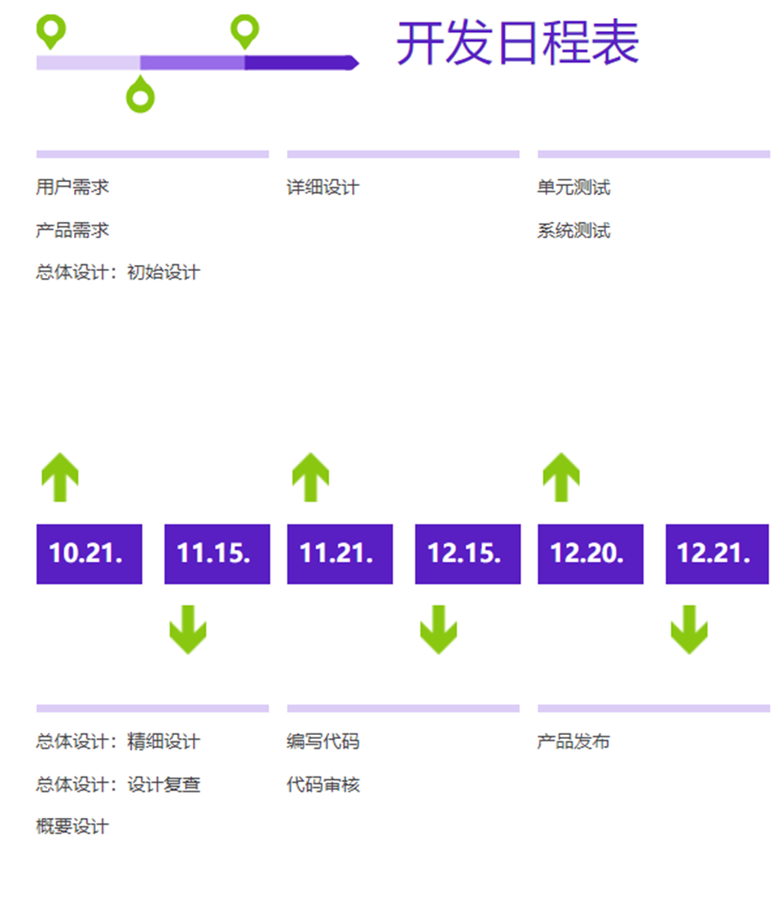
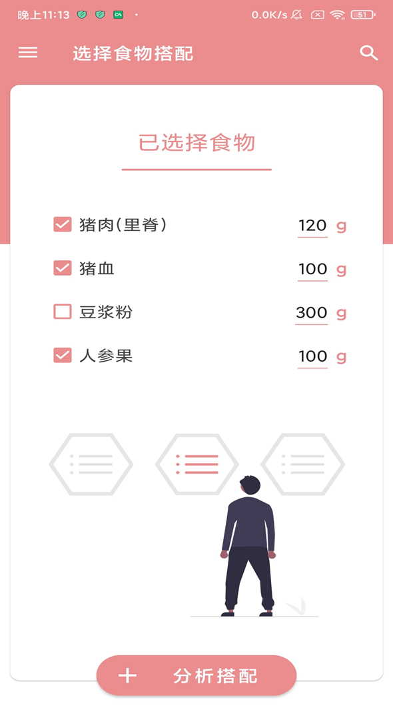
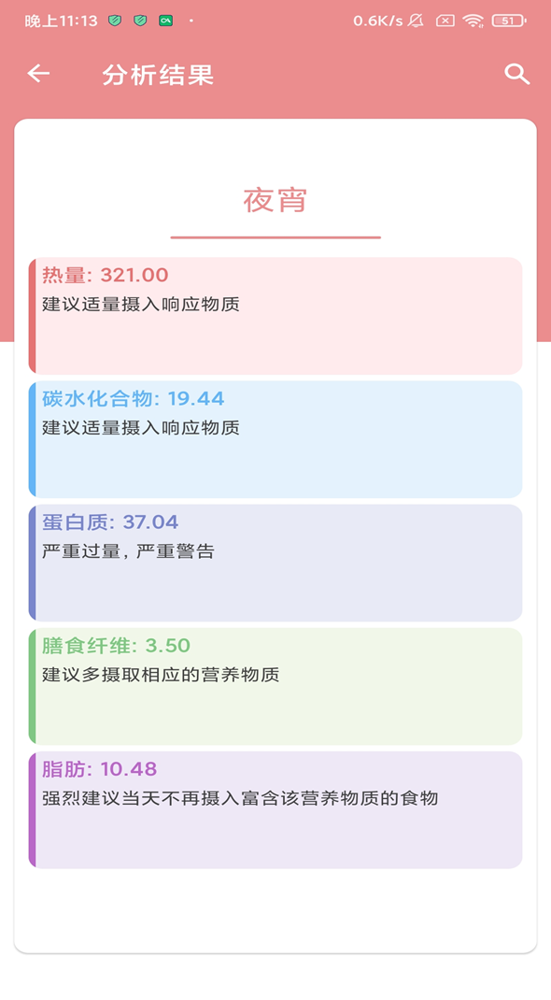
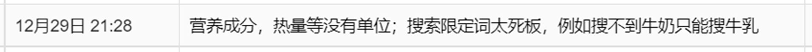
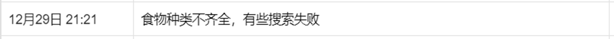
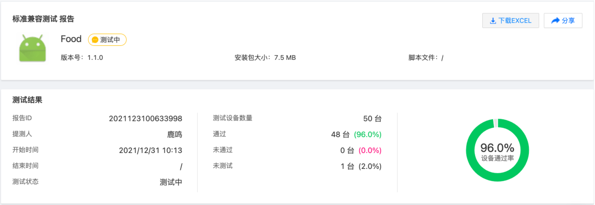
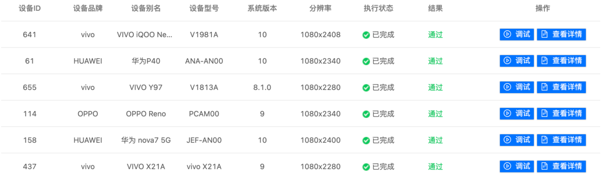
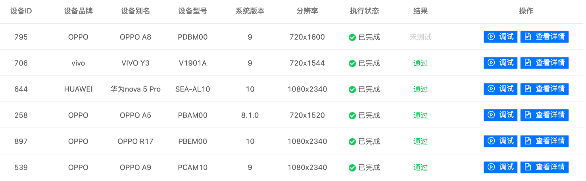
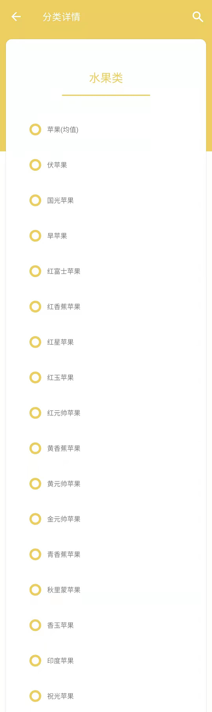

##                                第十五小组系统开发说明文件

| 小组成员 |    学号     |
| :------: | :---------: |
|   陈霖   | 20192131082 |
|  梁诺明  | 20192131031 |
|  黄景泰  | 20192131099 |
|  钱伯韬  | 20192131026 |

[TOC]


### 一、产品设计方案

- 项目实施可行性报告（行业市场分析、竞争对手或同类产品分析、自身条件分析）
- 产品定位及目标（用户群分析等）
- 产品内容总策划（应用流程规划，设计与测试规范，开发日程表）
- 技术解决方案
- 推广方案
- 运营规划书

#### 1 项目实施可行性报告

##### 1.1 行业分析

​		近年来，中国消费者对健康生活的追求持续加强，营养保健产业市场规模也有较高幅度的持续增强。消费者们的生活理念、健康管理行为正在发生变化，结合技术创新、产品与服务模式创新，市场需求也呈现出一些演变趋势。

​		对健康生活的追求导致人们对改善营养摄入产生更多需求。人们健康生活依赖三大支持：**合理营养摄入**；**适当规律运动**；**良好休息睡眠**。当代人健康生活意识的不断提升，使得对如何吃得健康营养也有了更多追求。

​		在日常饮食中，要想吃得健康，首先人们通过食物成分搭配及量上的控制，来令餐食更有利于健康；此外，通过选择额外服用营养补充剂等保健品来弥补日常餐食中较为缺失的营养成分。

​		“精准营养”逐渐成为营养健康产业新热点，尤其在2020 年新冠疫情影响下，全球健康意识普遍增强，个性化营养受到市场热捧。据Markets and markets研报数据显示，目前，个性化营养市场规模增长势头强劲，预计2025年将增至164亿美元。

##### 1.2 竞争对手/同类型产品分析

###### 1.2.1 香港食物安全中心官网：https://www.cfs.gov.hk/sc_chi/nutrient/search1.php

优势：信息来源真实可靠

缺点：页面简陋，无移动端应用，搜索结果极其模糊，信息筛选成本高

###### 1.2.2 中国营养学会食物营养成分查询平台：https://fq.chinafcd.org/

优势：成分详细，检索成本低

缺点：无移动端应用，信息过少，无法记录保存信息

###### 1.2.3 美国农业部网站的食物成分数据库：https://fdc.nal.usda.gov/ndb/search/list

优势：数据多样权威

缺点：访问困难，许多中国特色产品无法找到，页面信息全英文

##### 1.3 自身条件分析

- 项目商业模式分析：在项目市场发展趋势研究的基础上，本部分将从项目条件分析入手，从项目商业价值角度判断适合发展的商业模式，最终确定了以订阅制为核心的盈利模式。

- 项目SWOT分析(优势、劣势、发展机会、竞争威胁)：分析项目发展的重要及难点，明确项目本身的优势、劣势、发展机会、竞争威胁等。

#### 2.产品内容总策划

##### 2.1  应用规划流程

- **为什么做？—— “我们为什么要开发这个产品？”（战略层）**

    解决人们对于快速精准了解食物具体营养成分的需求。

- **做什么？—— “我们要开发的是什么？”（范围层）**

    我们的产品主要以功能性为主，向用户精准快速地提供食物营养成分。

- **怎么做？——“我们如何达到上述抽象层面所确定的问题？”（结构层、框架层、表现层）**

    我们的产品将首先立足于最基本的需求痛点——通过用户输入食物名称或者相关信息返回相应的营养信息，供用户利用这些信息制定饮食方案。除此之外，我们将追求实现动态记录用户每一天的营养摄入情况，并且通过用户设定的营养目标动态地为用户提供饮食建议。

##### 2.2 设计与测试规范

###### 2.2.1.功能测试

**接口测试**
前后端分离项目开发实现过程中，后端接口编码调试通过后，要及时进行接口测试。
接口测试的重点是要检查数据的交换，传递和控制管理过程，以及系统间的相互逻辑依赖关系等。

**主要注意点：**
1、 业务功能正常场景、异常场景
2、 输入输出边界测试：参数必填非必填；参数排序、个数、类型；参数长度；参数包含特殊字符

**接口测试工具**：**postman**、jmeter

**功能测试**
对软件功能进行的测试，主要检查软件功能是否实现了软件功能说明书（软件需求）上的功能要求，由
测试负责人编写测试计划、测试用例，并实施，功能测试过程应记录缺陷并跟进解决。

功能测试一般进行**如下几种情况**的测试：
1、 正常情况
2、 非正常情况
3、 边界情况
4、 非法情况
5、 强度测试
6、 破坏性测试
7、 兼容性测试
8、 用户友好性测试

**界面设计规范测试：**
1、 字体是否统一
2、 字号是否符合规定
3、 界面布局是否合理，整体效果如何

**输入值测试：**
1、 数据类型
2、 数据长度
3、 约束条件是否满足，是否完整

**性能测试**

性能测试的主要是范围：
1、系统的大用户压力；
2、系统的并发用户压力；
3、系统的数据库压力；
4、系统的稳定性等
输出《性能测试报告》，主要包括：性能指标：平均响应速度、吞吐量、系统用户的压力等数据。

**测试工具**：Loadrunner、jmeter

**兼容性测试**
兼容性测试主要包括web兼容性测试、APP兼容性测试、APP接口版本兼容性测试和数据兼容性测试

**生产环境测试**
将软件部署到用户实际生产环境后，由于环境差异，需要在用户现场进行确认测试，保证系统功能、性能完备，可正常运行。

###### 2.2.2.测试用例标准

**用例颗粒度原则**：测试用例是执行的最小实体

用例划分基本原则是以最小功能模块来划分，为保障用例的可执行性、覆盖度，规范编写用例的**粒度要求**如下：
1.一个功能正常流程，编写一个测试用例；
2.一个功能中多个异常流程，应分开编写多个测试用例；
3.同一功能不同入口，可合并编写一个测试用例；
4.同一功能不同数据准备，应分开编写多个测试用例；
5.同一个功能用例的自动化用例和功能用例要匹配，若自动化用例不能完 全覆盖功能用例，自动化用例和功能用例拆分两个互补测试用例；

**用例编写要求规范：**
1.具有清晰名称、前提条件、操作步骤、期望结果的；
2.可被他人理解的；
3.可被他人执行的；

##### 2.3 开发日程表




#### 3.产品定位及目标

##### 3.1 用户定位

​		产品主要供给想要规范化自己日常饮食的人群，如计划在减肥的肥胖人士，需要控制饮食的病人之类的。这类人群需要比较精确的知道食物的营养成分，让自己的饮食可以合理的提供所需的营养。而且这类人群有能力也会接受付费的定制化服务，消费水平可观。

##### 3.2 功能定位

- 可查询各种食物的营养成分，使用户可以准确的清楚吃什么食物能获得所需营养

- 收录各种常见疾病应该摄入的营养，提供相应的饮食方案

##### 3.3 风格定位

- 主要以查询功能为主，辅以提供建议的功能，帮助目标用户更好的规划自己的日常饮食

#### 4.技术解决方案

##### 4.1 使用营养成分表查询接口查询某种食物的营养成分


##### 4.2 返回示例


#### 5.推广方案

##### 5.1 线上推广方案

- 基础上线：各大下载市场、应用商店、大平台、下载站的覆盖Android版本发布渠道

- 应用商店：geogle商店、小米商城、魅族商店、oppo应用商店、华为应用商店等。

- 客户端：豌豆荚手机精灵、91手机助手、360软件管家等。

##### 5.2 线下推广方案

- 采用免费用户通过邀请新用户注册可解锁高级功能的模式

#### 6.运营规划书

##### 6.1 种子期

- 主要目的在于收集用户行为数据，与产品设计时的用户模型做对比，有目的性调优。

- 主要关注数据有：页面路径转化，按钮点击，启动次数，启动时间段，停留时长等。

- 这个阶段数据量不求大，但求真实，用户来源的话，可以先做免费渠道，如果能有一些首发资源更好了。

##### 6.2 推广期

- 主要目的在于扩大影响，吸收用户。

- 主要关注数据有：新增，活跃，留存以及渠道数据。

    

### 二、产品实现方案

- 系统的主要功能
- UI界面设计
- 关键技术和技术难点
- 用户体验记录和分析
- 已完成的改进和存在的问题

#### 1.系统的主要功能和UI界面设计

##### 1.介绍界面——介绍项目功能


##### 2.查询界面——查询食物营养信息


##### 3.搭配界面——分析已选择食物的营养情况






##### 4.分类界面——查询食物分类信息


##### 5.开发者信息界面——显示开发者信息和项目地址


#### 2.关键技术和技术难点

##### 2.1 主要功能

- [x] 可以直接通过关键字模糊搜索某种食物的营养成分
- [x] 可以在分类页面查看每个分类下每个具体食物的营养成分
- [x] 可以把已查询到的食物添加进分析列表
- [x] 可以对分析列表中的食物进行选择和输入具体食用量
- [x] 可以根据当前时间结合营养需求给出建议
- [x] 每个fragment都有不一样的颜色，会自动改变，侧边栏的部分也会随之改变

##### 2.2 技术难点

###### 1.分类详情获取

调用`addOnScrollListener`判断滑到顶部还是底部，然后获取上一页或下一页的数据就好

```kotlin
binding.recyclerView.addOnScrollListener(object : RecyclerView.OnScrollListener() {
    override fun onScrolled(recyclerView: RecyclerView, dx: Int, dy: Int) {
        super.onScrolled(recyclerView, dx, dy)

        //Log.i("page_test", "--------------------------------------")
        if (binding.recyclerView.canScrollVertically(1)) {
            //Log.i(TAG, "direction 1: true")
        } else {
            Log.i("page_test", "direction 1: false") //滑动到底部
            page_num++
            Log.i("page_test","page = $page_num")
            detailViewModel.getFoodList(foodCategoryName, page_num)
            jumptofirst()
        }
        if (binding.recyclerView.canScrollVertically(-1)) {
            //Log.i(TAG, "direction -1: true")
        } else {
            Log.i("page_test", "direction -1: false") //滑动到顶部
            page_num--
            Log.i("page_test","page = $page_num")
            detailViewModel.getFoodList(foodCategoryName, page_num)
            jumptofirst()
        }
    }
})
```

###### 2.分析列表的暂时存储和修改

把数据存进viewmodel里，只要绑定的是activity就能不随着fragment的生命周期变化

```kotlin
selectViewModel =
    ViewModelProvider(activity!!).get(SelectViewModel::class.java)
```

###### 3.界面的颜色随fragment变化而改变

通过navController获取此时的fragment的ID，然后改变就行，这个侧边栏的headerlayout的改变才是难点，要先获取它的id，getHeaderView(0)指的是第一个headerlayout

```kotlin
fun appbarcolor(navController:NavController){//用于改变actionbar和statusbar颜色
    val header = binding.navView.getHeaderView(0).findViewById<View>(R.id.draw_header)

    navController.addOnDestinationChangedListener { _, destination, _ -> when(destination.id){
        R.id.nav_home -> {binding.appBarMain.toolbar.setBackgroundColor(Color.parseColor("#00c48c"))
            header.setBackgroundColor(Color.parseColor("#00c48c"))
            window.statusBarColor = Color.parseColor("#00c48c")

        }
        R.id.nav_search -> {binding.appBarMain.toolbar.setBackgroundColor(Color.parseColor("#0084f4"))
            header.setBackgroundColor(Color.parseColor("#0084f4"))
                window.statusBarColor = Color.parseColor("#0084f4")}
        R.id.nav_select -> {binding.appBarMain.toolbar.setBackgroundColor(Color.parseColor("#EB8C8F"))
            header.setBackgroundColor(Color.parseColor("#EB8C8F"))
                window.statusBarColor = Color.parseColor("#EB8C8F")}
        R.id.nav_tag -> {binding.appBarMain.toolbar.setBackgroundColor(Color.parseColor("#ECCE5F"))
            header.setBackgroundColor(Color.parseColor("#ECCE5F"))
                window.statusBarColor = Color.parseColor("#ECCE5F")}
        R.id.nav_about -> {binding.appBarMain.toolbar.setBackgroundColor(Color.parseColor("#ffa26b"))
            header.setBackgroundColor(Color.parseColor("#ffa26b"))
                window.statusBarColor = Color.parseColor("#ffa26b")
        }
    }

    }
}
```

###### 4.打开侧边栏后状态栏的颜色问题

监控侧边栏滑动程度就好了

```kotlin
drawerLayout.addDrawerListener(object : DrawerListener {
    override fun onDrawerSlide(drawerView: View, slideOffset: Float) {
        //抽屉正在滑动时调用
        if (drawerLayout.isDrawerVisible(GravityCompat.START)) {
            //部分可见就会进入
            window.statusBarColor = Color.TRANSPARENT
        }
        else{
            appbarcolor(navController)
        }
    }

    override fun onDrawerOpened(drawerView: View) {
        //抽屉完全打开后调用


    }

    override fun onDrawerClosed(drawerView: View) {

    }

    override fun onDrawerStateChanged(newState: Int) {}
})
```

###### 5.appbar的跳转问题

直接把appbar里面的item改成和drawer里的id一样就能用navigation组件之间导航了

```kotlin
override fun onOptionsItemSelected(item: MenuItem): Boolean {

    return item.onNavDestinationSelected(findNavController(R.id.nav_host_fragment_content_main))
            || super.onOptionsItemSelected(item)
}
```

###### 6.在reycleview中跳转fragment

要在`onBindViewHolder`调用`findNavController().navigate()`

###### 7.传递自定义类

通过bundle传递，利用navigation组件，调用`bundle.putParcelable`，但要先让类实现`Parcelable`接口

```kotlin
@Parcelize
data class Food(val name:String="",
                var isSelected:Boolean=true,
                var intakeAmount:Int = 100,
                @SerializedName("rl") var power:Float=0.0F,
                @SerializedName("dbz") var protein:Float=0.0F,
                @SerializedName("zf") var fat:Float=0.0F,
                @SerializedName("shhf") var carbohydrate:Float=0.0F,
                @SerializedName("ssxw") var diaryFiber:Float=0.0F):Parcelable {
    override fun equals(other: Any?): Boolean {
        if (other != null) {
            return if (other::class.java == Food::class.java) {
                val food = other as Food
                (food.name == name && food.protein == protein && food.fat == fat
                        && food.carbohydrate == carbohydrate && food.diaryFiber == diaryFiber)
            } else {
                false;
            }
        }
        return false
    }

    override fun hashCode(): Int {
        var result = name.hashCode()
        result = 31 * result + power.hashCode()
        result = 31 * result + protein.hashCode()
        result = 31 * result + fat.hashCode()
        result = 31 * result + carbohydrate.hashCode()
        result = 31 * result + diaryFiber.hashCode()
        return result
    }
}
```

#### 3.用户体验记录和分析

###### 1.用户反馈精选






###### 2.用户反馈分析

- 食物种类不全：接口能够返回的食物类型极其有限
- 分析功能没有单位：单纯的单位制不够直观，表示成标准值的百分数形式更容易让用户接受和使用
- 软件功能不够丰富：后续可能会根据分析功能得到的结果自动推荐用户需要的食物

#### 4.已完成的改进和存在的问题

##### 4.1 改进的问题

- 将搜索改为模糊搜索，增加搜索成功率
- 将分析功能提供的营养分析以标准值百分数的形式给出，并给出了不同情况的提示文字

##### 4.2 接口单一

由于经费限制，自建数据库又相当困难，目前还无法解决接口返回的食物种类匮乏的缺点，后续考虑采用一些专业的商业接口。

### 三、测试大纲和测试报告

#### 3.1 测试大纲

- **接口测试**
    前后端分离项目开发实现过程中，后端接口编码调试通过后，要及时进行接口测试。
    接口测试的重点是要检查数据的交换，传递和控制管理过程，以及系统间的相互逻辑依赖关系等。

- **主要注意点：**
    1、 业务功能正常场景、异常场景
    2、 输入输出边界测试：参数必填非必填；参数排序、个数、类型；参数长度；参数包含特殊字符

- **接口测试工具**：**postman**、jmeter

- **功能测试**
    对软件功能进行的测试，主要检查软件功能是否实现了软件功能说明书（软件需求）上的功能要求，由测试负责人编写测试计划、测试用例，并实施，功能测试过程应记录缺陷并跟进解决。列出该模块的测试流程，比测试用例的粒度大，可以写比较大一点的模块。测试数据怎么产生、测试结果怎么查看、异常情况如何判断。

- 功能测试一般进行**如下几种情况**的测试：
    1、 正常情况
    2、 非正常情况
    3、 边界情况
    4、 非法情况
    5、 强度测试
    6、 破坏性测试
    7、 兼容性测试
    8、 用户友好性测试

- **界面设计规范测试：**
    1、 字体是否统一
    2、 字号是否符合规定
    3、 界面布局是否合理，整体效果如何

- **输入值测试：**
    1、 数据类型
    2、 数据长度
    3、 约束条件是否满足，是否完整

- **性能测试**的主要是范围：
    1、系统的大用户压力；
    2、系统的并发用户压力；
    3、系统的数据库压力；
    4、系统的稳定性等
    输出《性能测试报告》，主要包括：性能指标：平均响应速度、吞吐量、系统用户的压力等数据。

- **测试工具**：Loadrunner、jmeter

    **兼容性测试**
    兼容性测试主要包括web兼容性测试、APP兼容性测试、APP接口版本兼容性测试和数据兼容性测试

- **生产环境测试**
    将软件部署到用户实际生产环境后，由于环境差异，需要在用户现场进行确认测试，保证系统功能、性能完备，可正常运行。

#### 3.2 测试用例标准

- **用例颗粒度原则**：测试用例是执行的最小实体

- 用例划分基本原则是以最小功能模块来划分，为保障用例的可执行性、覆盖度，规范编写用例的**粒度要求**如下：
    1.一个功能正常流程，编写一个测试用例；
    2.一个功能中多个异常流程，应分开编写多个测试用例；
    3.同一功能不同入口，可合并编写一个测试用例；
    4.同一功能不同数据准备，应分开编写多个测试用例；
    5.同一个功能用例的自动化用例和功能用例要匹配，若自动化用例不能完 全覆盖功能用例，自动化用例和功能用例拆分两个互补测试用例；

- **用例编写要求规范：**
    1.具有清晰名称、前提条件、操作步骤、期望结果的；
    2.可被他人理解的；
    3.可被他人执行的；

#### 3.3 测试报告

- 测试方式：wetest，用户使用反馈

- 测试结果：除去没有测试的，wetest平台49台设备全部通过，bug数量为0；测评用户数量为15，年龄分布在17~21，目前在已经的安卓设备上还没有出现过bug







### 四、产品安装和使用说明

#### 4.1 产品安装

**Food' secret（营养咨询app）**

> **项目地址：**[2021autumn-A15-Nutrition-consultation

安装步骤：

- 打开项目地址，下载 **.apk格式**的项目app
- 根据手机或者模拟器提示安装APP

#### 4.2 使用说明

- 在进入项目的主界面，包含了本App所有功能的提示信息


- 点击左上角三条横线的图标，跳转到主菜单界面


- 点击右边的搜索框可以直接跳转到搜索界面
- 食物搭配功能可以在搜索功能和食物分类功能李挑选食物。分析所搭配事物的营养成分，还可以选择单独分析以及修改食物的分量


- 分析结果会自动获取当前的时间，显示现在是哪一餐的时间段


- 食物分类功能只要按照app显示的选择分类即可看到分类下的食物



- 点击出现的食物，即可查看对应的营养信息


